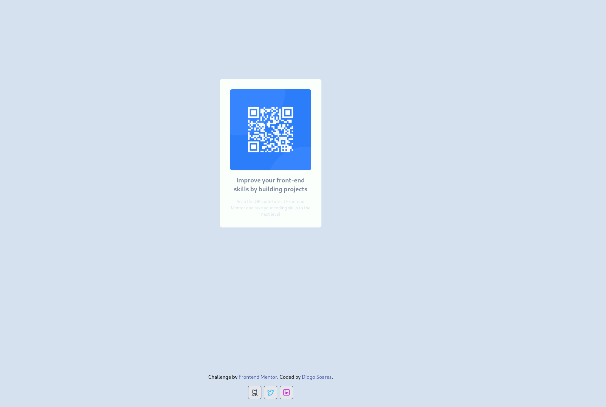

# Frontend Mentor - QR code component solution

This is a solution to the [QR code component challenge on Frontend Mentor](https://www.frontendmentor.io/challenges/qr-code-component-iux_sIO_H). Frontend Mentor challenges help you improve your coding skills by building realistic projects. 

## Table of contents

- [Overview](#overview)
  - [Screenshot](#screenshot)
  - [Links](#links)
- [My process](#my-process)
  - [Built with](#built-with)
- [Author](#author)

## Overview

### Screenshot

### Links

- Solution URL: [Github](https://github.com/dioggosoares/qr-code-challenge)
- Live Site URL: [Vercel](https://qr-code-challenge-puce.vercel.app/)

## My process

### Built with

- Semantic HTML5 markup
- CSS Framework (Tailwind)
- Mobile-first workflow
- [React](https://reactjs.org/) - JS library
- [Tailwind](https://tailwindcss.com/) - For styles

## Author

- Website - [Diogo Soares](https://github.com/dioggosoares)
- Frontend Mentor - [@dioggosoares](https://www.frontendmentor.io/profile/dioggosoares)
- Twitter - [@dioggosoares](https://twitter.com/dioggosoares)